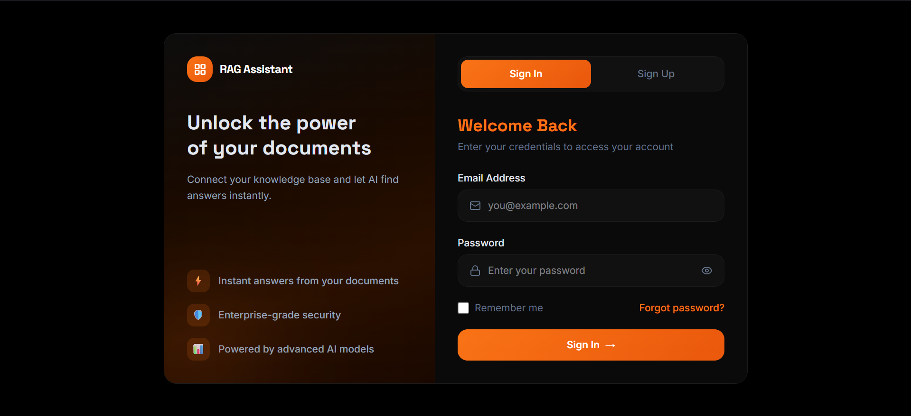
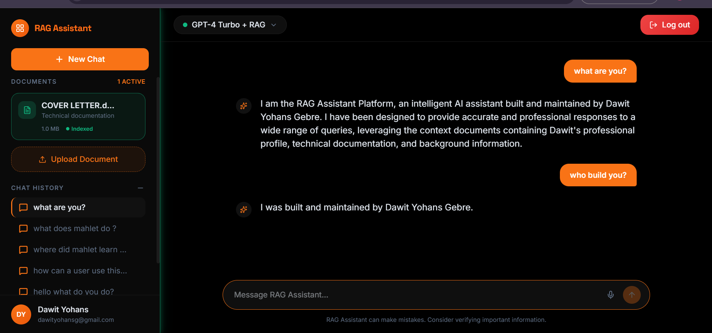
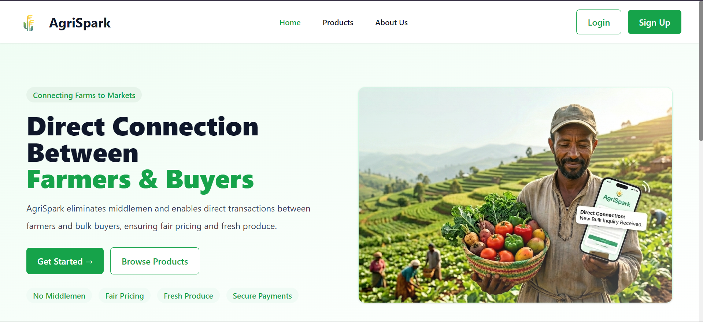
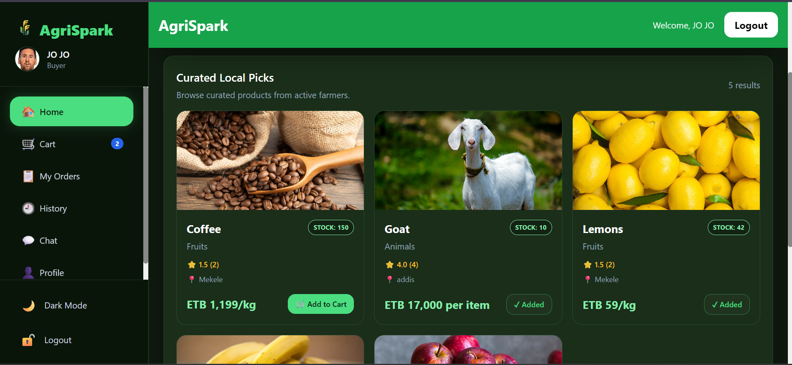
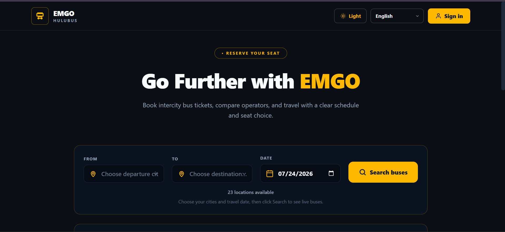
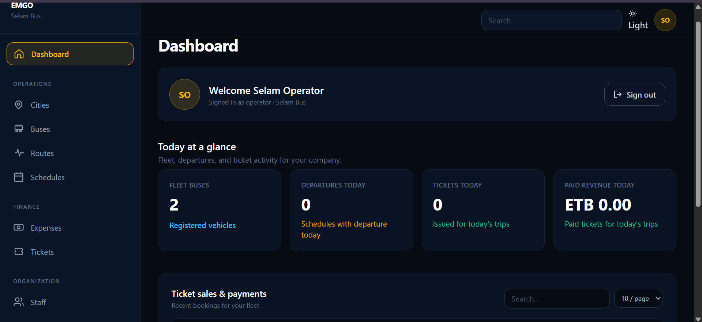

# 🚀 Featured Projects

<table>

<tr>

<td width="50%" valign="top">

## 🤖 RAG Assistant

Multi-tenant AI knowledge platform built with vector search and Retrieval-Augmented Generation.

**Tech Stack**

FastAPI • React • TypeScript • LlamaIndex • Qdrant

</td>

<td width="50%" valign="top">

## 🌾 AgriSpark

A modern digital marketplace connecting farmers and buyers.

**Tech Stack**

Next.js • Express • PostgreSQL • Supabase

</td>

</tr>

<tr>

<td width="50%" valign="top">

## 🚌 EMGO Bus Platform

Bus operations and ticket management platform.

**Tech Stack**

PHP • MySQL • Tailwind CSS

</td>

<td width="50%" valign="top">

## 📱 Quiz App

Cross-platform quiz application with interactive gameplay.

**Tech Stack**

React Native • Expo • JavaScript

</td>

</tr>

</table>
