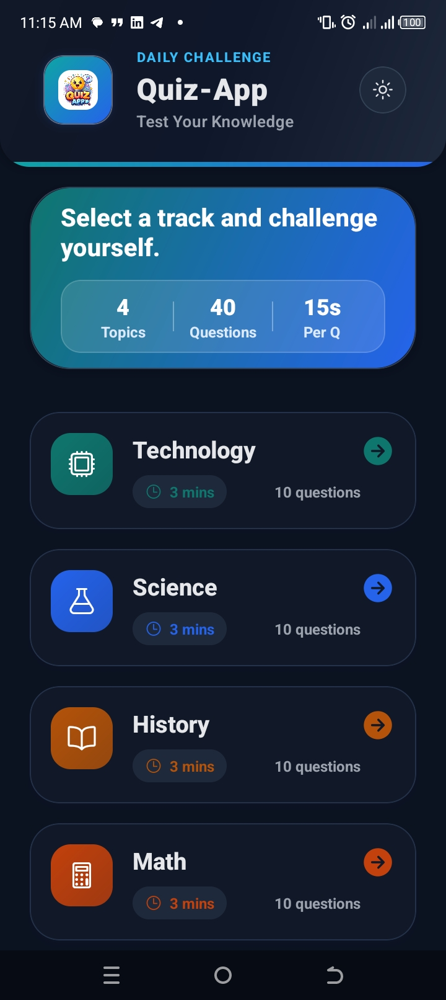
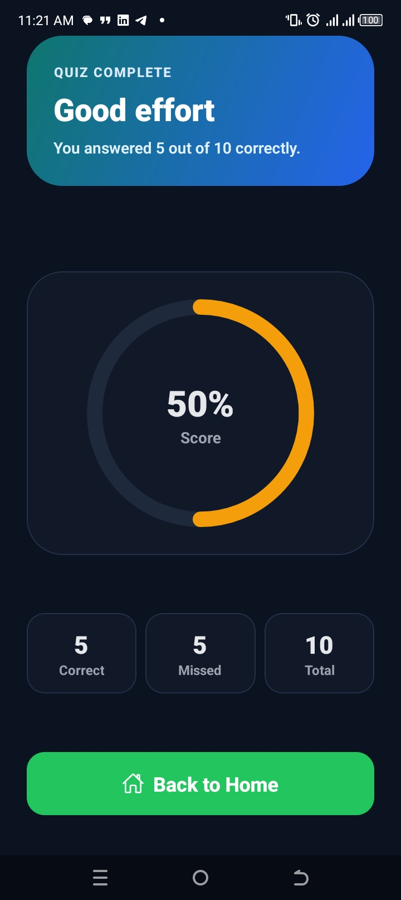

# Hi 👋, I'm Dawit Yohans

### AI • Machine Learning • Backend • Full Stack

Building intelligent software for real-world problems through Artificial Intelligence, scalable backend systems, and modern full-stack development.

---

# 👨‍💻 About Me

I'm an Information Science student passionate about **Artificial Intelligence**, **Machine Learning**, **Backend Engineering**, and **Full-Stack Development**.

I enjoy building software that solves real-world problems—from AI-powered knowledge systems to agricultural marketplaces and transportation platforms. My goal is to become an AI Engineer and build products that create meaningful impact.

### Current Focus

- 🤖 Retrieval-Augmented Generation (RAG)
- 🧠 Machine Learning & LLM Applications
- ⚙️ Backend Architecture & API Design
- 🌐 Full-Stack Web Applications
- 🚀 Building production-ready software

---

# 🛠 Tech Stack

### AI & Machine Learning

---

# 🚀 Featured Projects

<table>

<tr>

<td width="50%" valign="top">

## 🤖 RAG Assistant

Multi-tenant AI knowledge platform built with vector search and Retrieval-Augmented Generation.

**Tech Stack**

FastAPI • React • TypeScript • LlamaIndex • Qdrant

</td>

<td width="50%" valign="top">

## 🌾 AgriSpark

A modern digital marketplace connecting farmers and buyers.

**Tech Stack**

Next.js • Express • PostgreSQL • Supabase

</td>

</tr>

<tr>

<td width="50%" valign="top">

## 🚌 EMGO Bus Platform

Bus operations and ticket management platform.

**Tech Stack**

PHP • MySQL • Tailwind CSS

</td>

<td width="50%" valign="top">

## 📱 Quiz App

Cross-platform quiz application with interactive gameplay.

**Tech Stack**

React Native • Expo • JavaScript

</td>

</tr>

</table>
---

## 💻 More Projects

| Project | Description |
|---------|-------------|
| **Student Management System** | CRUD application with REST APIs, analytics dashboard, and MongoDB backend. |
| **More AI Projects** | Currently building AI assistants, ML applications, and intelligent automation systems. |

---

# 📊 GitHub Analytics

---

# 🎯 Goals

- 🚀 Become an AI Engineer
- 🧠 Master Machine Learning & Deep Learning
- ⚙️ Build scalable backend systems
- 🌍 Develop AI products that solve real-world problems
- 💡 Launch impactful technology startups

---

# 📫 Connect With Me

---

### ⭐ Thanks for visiting my profile!

*"I believe great software is built by understanding real problems before writing code."*

